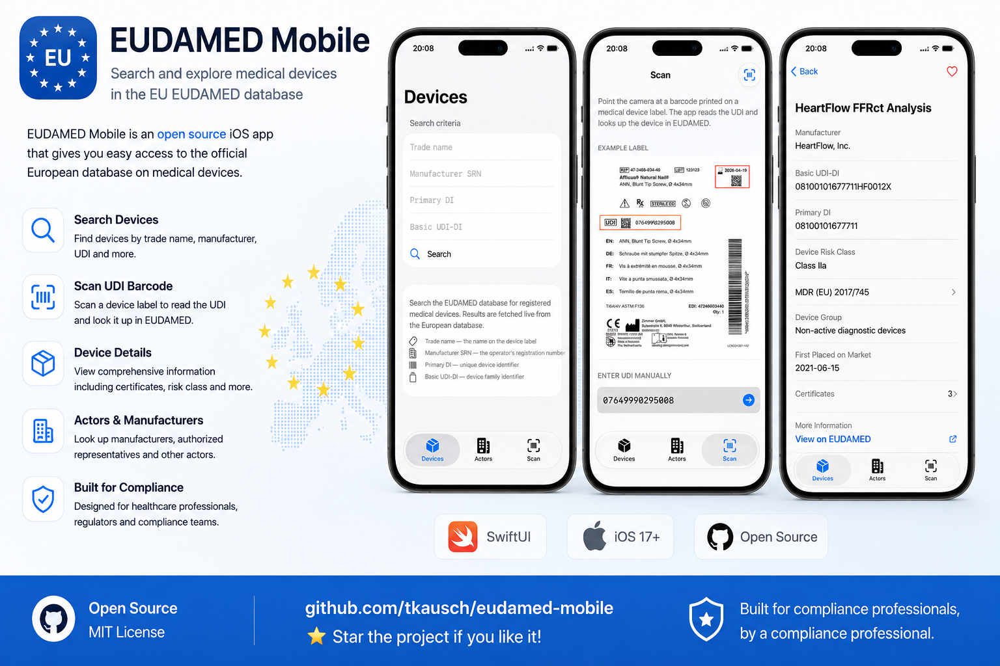

# EUDAMED Mobile



An iOS app for looking up medical devices and economic operators in the [European Database on Medical Devices (EUDAMED)](https://ec.europa.eu/tools/eudamed).

## Overview

EUDAMED Mobile provides regulatory affairs specialists, biomedical engineers, and field technicians with fast, live access to the EUDAMED public API. Every search hits the database directly — there is no local copy of EUDAMED data.

### Three tabs

| Tab | What it does |
|-----|-------------|
| **Devices** | Search UDI device records by trade name, manufacturer SRN, Primary DI, or Basic UDI-DI |
| **Actors** | Search economic operators (manufacturers, authorised representatives, importers) by name, SRN, type, or country |
| **Scan** | Point the camera at a barcode on a device label to look it up instantly; manual entry fallback included |

## Requirements

- iOS 17 or later
- iPhone (portrait; iPad not targeted)
- Active internet connection — the app is read-only and makes no requests on behalf of the user beyond EUDAMED API calls

## Architecture

The app is built with SwiftUI and follows the `@Observable` pattern throughout. There are no view models backed by Combine and no local database.

```
AppState                         // holds live repository instances
├── RemoteUdiDevicesRepository   // device queries via eudamed-public
└── RemoteActorRepository        // actor queries via eudamed-public
```

Network access is provided by the [eudamed-public](https://github.com/tkausch/eudamed-public) Swift Package, which wraps the EUDAMED REST API using Swift OpenAPI Generator.

### Key source files

| File | Role |
|------|------|
| `App.swift` | Entry point; injects `AppState` into the environment |
| `AppState.swift` | Constructs live repositories shared across tabs |
| `ContentView.swift` | Root `TabView` wiring the three tabs |
| `DeviceSearchView.swift` | Device query form, results list, and row |
| `DeviceDetailView.swift` | Full device record grouped into sections |
| `ActorSearchView.swift` | Actor query form and results |
| `ActorDetailView.swift` | Full actor registration record |
| `ScannerView.swift` | VisionKit barcode scanner with manual-entry fallback |
| `UdiDeviceLabelView.swift` | Visual UDI label card used in device detail and scan guidance |

## Scanning

The Scan tab uses `DataScannerViewController` (VisionKit) and decodes QR codes, Code 128, EAN-13/8, Code 39, PDF-417, and Aztec barcodes. When a barcode is read, the Primary DI (GS1 Application Identifier `(01)`) is extracted and sent to EUDAMED.

If the camera is unavailable or access is denied, the tab falls back to a manual-entry field annotated with a sample UDI label to show which number to type.

## Privacy

- No analytics on query content
- No EUDAMED response is written to disk
- Only EUDAMED API query parameters leave the device

## Dependencies

| Package | Purpose |
|---------|---------|
| [eudamed-public](https://github.com/tkausch/eudamed-public) | EUDAMED REST client, model types, repository protocols |
| [swift-openapi-runtime](https://github.com/apple/swift-openapi-runtime) | OpenAPI runtime (transitive) |
| [swift-http-types](https://github.com/apple/swift-http-types) | HTTP primitives (transitive) |
| [swift-collections](https://github.com/apple/swift-collections) | Ordered collections (transitive) |

## Building

Open `eudamed-mobile.xcodeproj` and run the `eudamed-mobile-iOS` scheme on any simulator or device running iOS 17+. No additional setup is required — Swift Package Manager resolves all dependencies automatically.

## License

Copyright © 2026 Thomas Kausch. All rights reserved.
